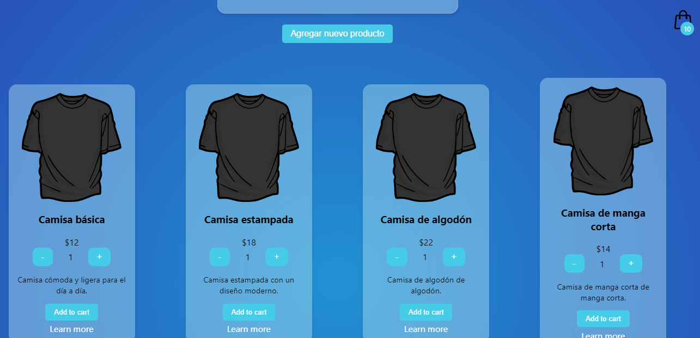
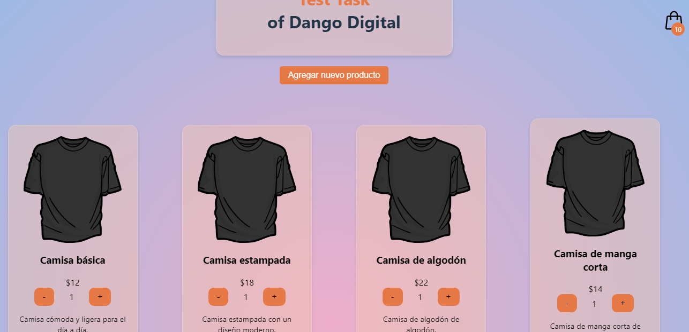

# Test of Dango Digital

this is a technical test done in React with TypeScript and CSS

## How install

clone the repository 

```
  git clone https://github.com/kevin3080/dangoDigitalTest.git
```

and install the dependencies

```
  yarn install
```

inicie su servidor en local con

```
yarn dev
```

## Features

the project consists of the simulation of an online store, allowing to add products, edit them in real time and add them to the shopping cart. The project is small but done with great care and attention to detail of the design, although I did it with very little time I tried to do my best. There was no prepared design, everything came out with a little imagination.


#### Color is set according to user preferences automatically

Dark Theme


Ligth Theme
